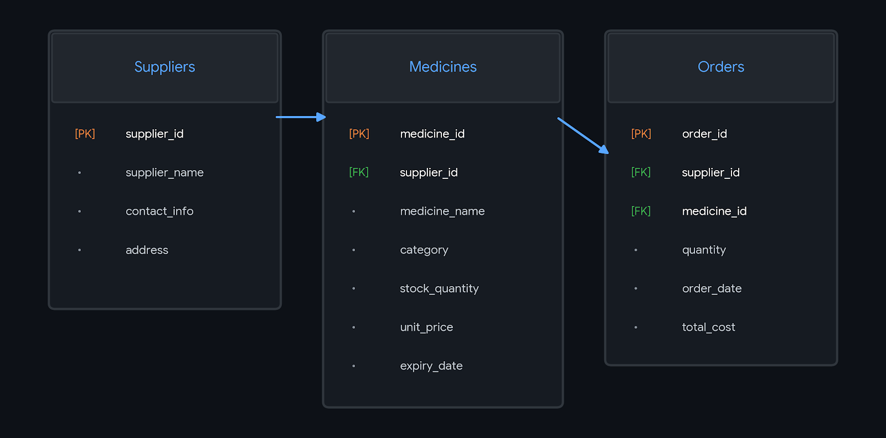

# 🏥 Hospital Inventory Management System (HIMS)

This project is a **Hospital Inventory Management System** built using **SQL**.  
It helps hospitals manage their medical supplies, track inventory, and streamline record-keeping for medicines, equipment, and other hospital resources.

---

## 📌 Features

- 📦 **Inventory Tracking** – Keep records of medicines, equipment, and supplies.
- 🧾 **Supplier Management** – Store supplier details for easy ordering.
- ⏳ **Stock Monitoring** – Track stock levels and expiration dates.
- 🏥 **Department-wise Allocation** – Assign inventory to specific departments.
- 📊 **Data Queries** – Generate reports using SQL queries.

---

## 🗂 Database Structure

The database consists of the following tables:

- **`Inventory`** – Stores all items available in stock.
- **`Suppliers`** – Contains supplier information.
- **`Departments`** – Details of hospital departments.
- **`Orders`** – Records of items ordered.
- **`Usage`** – Logs usage of items by departments.
- *(Additional tables as per your SQL script)*

---

## ⚙️ Technologies Used

- **Database:** MySQL / MariaDB
- **Language:** SQL
- **Tools:** MySQL Workbench / phpMyAdmin / Command Line

---
## 🗂️ Database Schema



## 📥 Installation & Setup

1. **Clone this repository**
   ```bash
   git clone https://github.com/yourusername/hospital-inventory-management.git
   cd hospital-inventory-management
